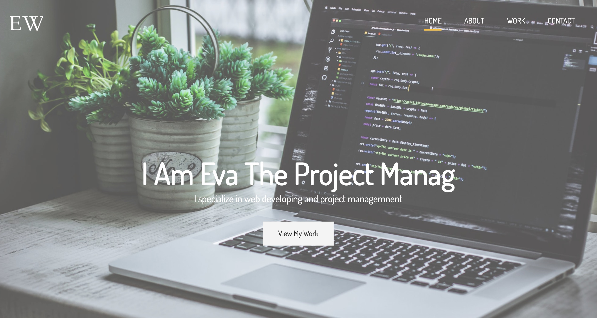

# Portfolio Website

> The portfolio website is an online resume, here you can display your skills ,projects you've done and even a contact form to let clients find you.

## Table of contents

- [General info](#general-info)
- [Screenshots](#screenshots)
- [Technologies](#technologies)
- [Setup](#setup)
- [Features](#features)
- [Status](#status)
- [Inspiration](#inspiration)
- [Contact](#contact)

## General info

The portfolio website is constructed of four pages, i.e., index.html, about.html, work.html and contact.html.

## Screenshots

## Technologies

- node-sass - version 4.13.1
- Javascript - ES6

## Setup

_no extra actions_

## Code Examples

Show examples of usage:
`<nav id="main-nav">  <ul> <li><a href="index.html" class="current">Home</a></li> <li><a href="about.html">About</a></li> <li><a href="work.html">Work</a></li> <li><a href="contact.html">Contact</a></li> </ul> </nav>`

## Features

List of features ready and TODOs for future development

- Progress bar
- Contact form

To-do list:

- Whatsapp popup

## Status

Project is: _in progress_, and will add more amazing features

## Inspiration

Add here credits. Project inspired by Brad Traversy, based on his course: "Modern HTML & CSS From The Beginning (Including Sass)".

## Contact

Created by [@Eva](https://www.facebook.com/profile.php?id=100042321316185) - feel free to contact me!
